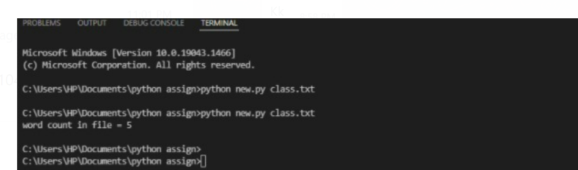

# command-line-arguments-to-count-word
## AIM:
To write a python program for getting the word count from the contents of a file using command line arguments.
## EQUIPEMENT'S REQUIRED: 
PC
Anaconda - Python 3.7
## ALGORITHM: 
### Step 1:
import sys
### Step 2: 
Assign a variable count =0
 
### Step 3: 
open a file in read mode

### Step 4:  
iterate a variable(lines) through the file
### Step 5: 
Assign a variable words = lines.split()
### Step 6: 
Now iterate through the variable and increase the count: and print and count value
## PROGRAM:

import sys
fp = open(sys.argv[1]) as fp
A = fp.read()
    count=0
    V=A.split()
    for i in V:
        count+=1 
print("count",V)
print("count",count)

### OUTPUT:

## RESULT:
Thus the program is written to find the word count from the contents of a file using command line arguments.
